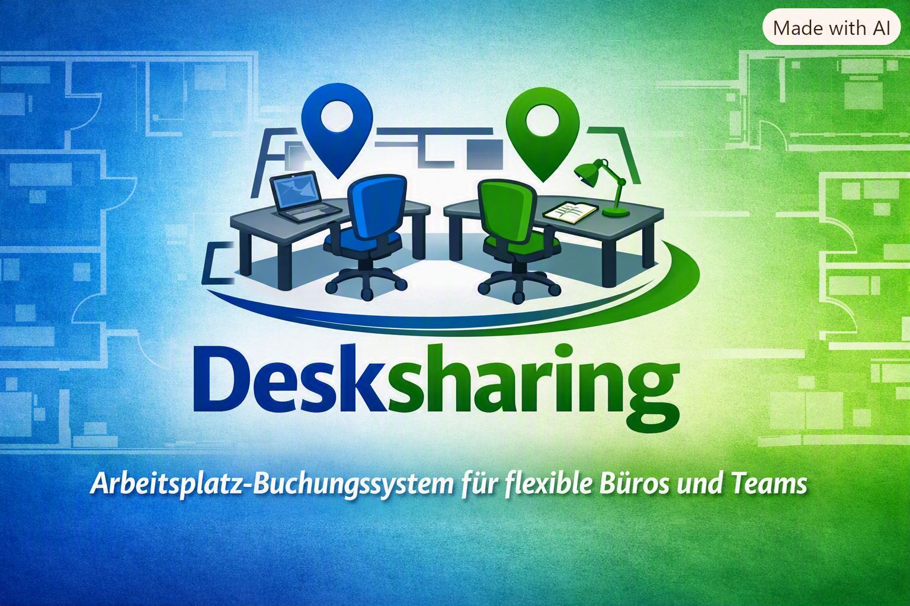

<p align="center">
  
</p>

# Desksharing – Arbeitsplatz‑Buchungssystem

Ein leichtgewichtiges, vollständig browserbasiertes Desksharing‑System zum Buchen von Arbeitsplätzen.
Ideal für kleine Teams, Büros, Vereine oder private Projekte.

Das System benötigt **keine Cloud**, **keine Accounts**, **keine Datenbank‑Server** – alles läuft lokal über Node.js und SQLite.

---

## 🚀 Features

### 🖥️ Grundriss & Tische
- Beliebiges Grundriss‑Bild hochladen
- Tische frei platzieren
- Tische verschieben (ALT + Drag)
- Tische skalieren (SHIFT + Drag)
- Tische löschen (Rechtsklick)
- Ganztags‑ oder Stundenbuchung pro Tisch

### 📅 Buchungssystem
- Tagesansicht
- Wochenkalender (Mo–Fr)
- Buchungen mit Zeitüberschneidungsprüfung
- Ganztagsbuchungen blockieren den gesamten Tag
- Stundenbuchungen blockieren nur Zeitfenster

### 🔐 Admin‑Bereich
- Admin‑Login mit Passwortfeld (••••)
- Passwort ändern (Benutzername, altes Passwort, neues Passwort + Wiederholung)
- Passwort wird sicher im Browser gespeichert (localStorage)

### 📤 Export
- Export **eines Tages** als ICS pro Tisch
- Export **einer Woche** als **eine einzige ICS‑Datei**
- Kompatibel mit Outlook, Apple Calendar, Google Calendar

### 🗄️ Backend
- Node.js + Express
- SQLite (automatisch erzeugt)
- Keine externe Abhängigkeit außer npm‑Modulen

---

## 📦 Installation

### 1. Repository klonen
```bash
git clone https://github.com/MacForAll/DeskSharing.git
cd DeskSharing
```

### 2. Abhängigkeiten installieren
```bash
npm install
```

### 3. Server starten
```bash
npm start
```

### 4. Browser öffnen
http://localhost:3000

---

## 🔧 Admin‑Login

Standard‑Zugangsdaten:

- **Benutzername:** `admin`
- **Passwort:** `admin`

Beides kann im Admin‑Bereich geändert werden.

---

## 📁 Projektstruktur
```markdown
📦 **DeskSharing/**
│
├── 📂 **public/**
│   ├── 📄 index.html
│   ├── 📄 script.js
│   ├── 🎨 style.css
│   └── 🖼️ Grundriss‑Bilder
│
├── 🗄️ **data.db** — SQLite‑Datenbank (automatisch erzeugt)
├── 🧩 **server.js** — Node.js Backend
├── 📦 **package.json**
└── 📘 **README.md**
```

---

## 🛠️ Roadmap / Ideen

- Monatsansicht
- Benutzer‑Rollen (User / Admin / Teamleiter)
- Farben pro Team
- Mobile UI
- PDF‑Export
- Drag‑&‑Drop Buchungen im Kalender
- Mehrere Standorte / Etagen

---

## 📄 Lizenz

Dieses Projekt ist unter der **MIT‑Lizenz** veröffentlicht.
Siehe Datei `LICENSE`.


---

## 🤝 Beiträge

Pull Requests sind willkommen!
Fehler, Ideen oder Wünsche bitte als Issue einreichen.

---

## ❤️ Autor

**Michael (MacForAll)**
Irgendwo, Deutschland
2026
